## VirtualBox 구성

Virtual Box를 이용해 7대의 VM을 생성한 후 1대의 VM에 Nexus와 Jenkins를 구성, 각각 3대의 VM에 Calico CNI, Cilium CNI 기반 쿠버네티스 클러스터를 구성하는 방법을 정리

### 1. 파일 다운로드

- VirtualBox (latest) : https://www.virtualbox.org/wiki/Downloads

- Ubuntu 24.04-LTS Server Image : https://ubuntu.com/download/server

### 2. Virtual Box Network 설정

#### 2.1 Network 종류

Vitual Box에서는 Nat, Bridge Adapter, Host-Only Adapter, Nat Network 등의 네트워크 어댑터를 지원한다. 각 네트워크 어댑터의 특징은 아래와 같다.

#### ① NAT

- Description : 호스트 PC의 IP를 통해 외부와 통신을 지원하는 어댑터
- Features :
  - VM에서 외부로 나가는 트래픽만 허용
  - VM 간의 통신 제한
  - 포트 포워딩 설정을 통해 외부에서 VM으로 접속
- Usage :
  - VM이 외부(인터넷) 접속만 필요한 경우 사용

#### ② NAT Network

- Description : NAT Adapter를 할당 받은 VM들을 하나의 네트워크로 묶어주는 어댑터
- Features :
  - 같은 네트워크에 속한 VM 간 통신 가능
  - VM에서 외부로 나가는 트래픽 허용
  - 포트 포워딩을 통해 외부에서 VM으로 접속
- Usage :
  - 다수의 VM을 이용해 클러스터를 구성하기위해 VM간 통신이 필요하면서 외부와의 통신이 필요한 경우 사용

#### ③ Bridge Adapter

- Description : 호스트 PC와 동일한 네트워크에 있는 독립적인 컴퓨터처럼 동작하게 해주는 어댑터
- Features :
  - 호스트가 연결된 네트워크 라우터(공유기)로 부터 직접 IP 할당
  - 호스트 PC와 같은 네트워크에 속한 다른 장치들과 VM 간의 통신 가능
- Usage : VM에서 실행되는 App, DB 서비스가 같은 네트워크에 속한 다른 장치들과 통신이 필요할 경우 사용

#### ④ Host-Only Adapter

- Description : 호스트 PC와 VM간의 통신만 가능한 네트워크 어댑터
- Features :
  - 외부 인터넷과 연결 제한
  - 호스트 PC와 VM 사이의 통신만 가능
- Usage : 호스트 PC와 VM 간에 파일을 공유하거나, 외부와는 격리된 안전한 테스트 환경을 만들고 싶을 때 사용

#### ⑤ Internal Network

- Description : VM 간의 통신만 지원하는 네트워크 어댑터
- Features :
  - 호스트 PC에서도 접근 불가
  - 외부 인터넷과 연결 제한
- Usage: 외부와 완전히 차단된 환경에서 VM 간의 통신을 테스트할 때 사용

#### 2.2 Network 설정

Tools → NAT Networks → Create → 설정 정보 입력

- Name: Kubernetes

- IPv4 Prefix : 10.0.0.0/16

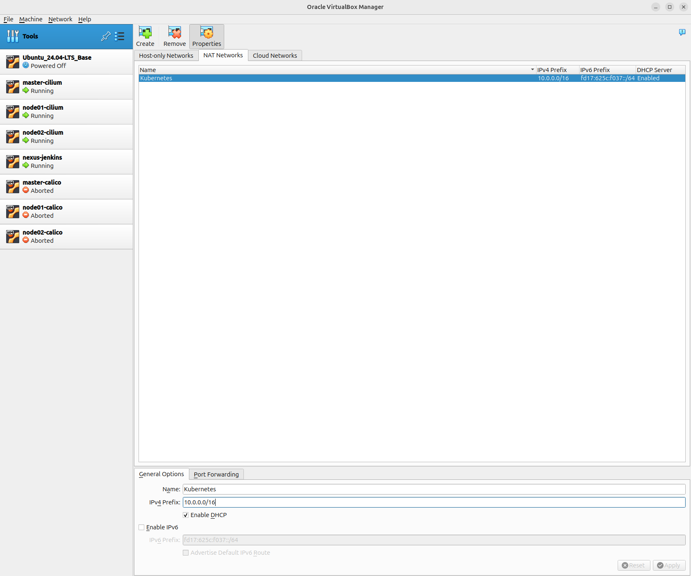

### 3. Base Image 생성

다운로드 받은 우분투 OS 설치를 마친 베이스 이미지를 만들어 두면 쿠버네티스 클러스터 구성에 필요한 VM을 복제하여 활용할 수 있다. 작업 과정에 추가 노드를 만들어야 하거나 초기화가 필요할 경우 베이스 이미지를 만들어 두지 않으면, OS 설치 과정부터 다시 시작해야 한다.

#### 3.1 VM 추가

#### ① Machine → new → 설정 정보 입력

- Name : Ubuntu_24.04_LTS_Base

- ISO Image : _<다운로드 받은 Ubuntu 24.04 이미지 파일 선택>_

- Skip Unattended Installation 체크

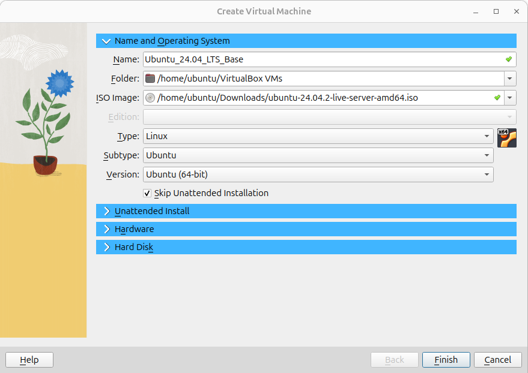

#### ② 'Unattended Install' Skip

#### ③ 'Hardware' 설정 정보 입력

- Processros : 2

- Memory : 2048 ~ 4096 MB

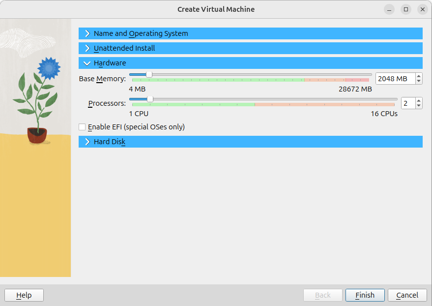

#### ④ 'Hard Disk' Skip

#### ⑤ Finish 버튼 클릭

#### 3.2 VM 추가

#### ① 'Ubuntu_24.04_LTS_Base' VM 더블 클릭 → 'Try or Install Ubuntu Server' 선택

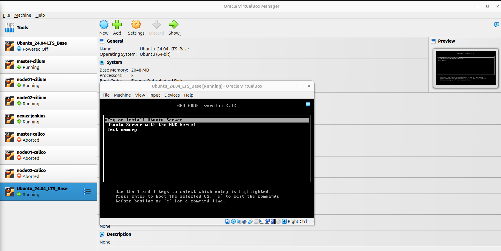

#### ② English 선택

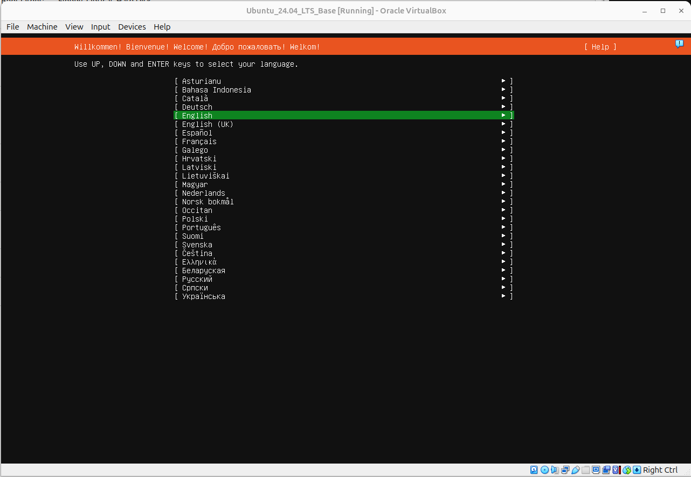

#### ③ 'Korean' 선택

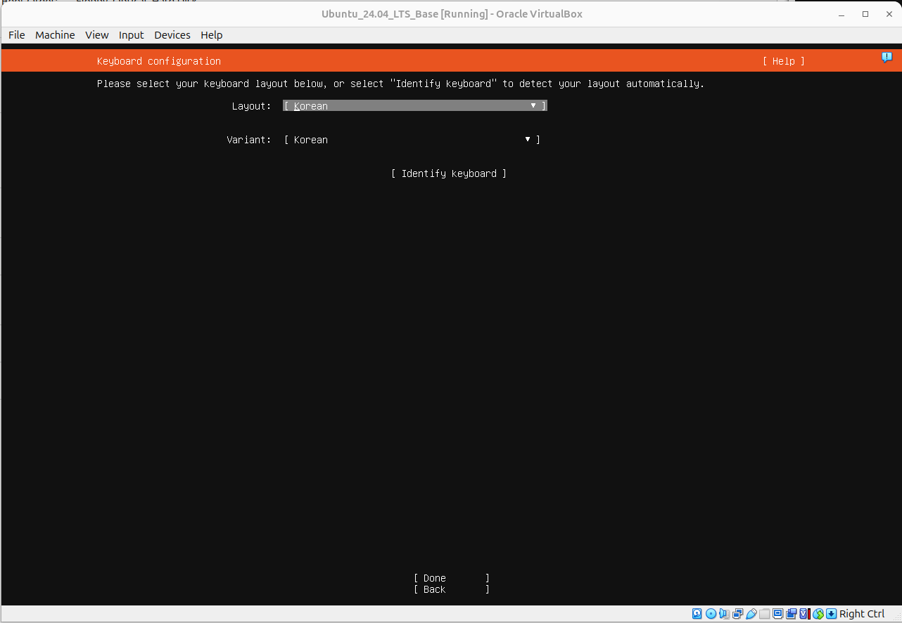

#### ④ 'Ubuntu Server' 선택

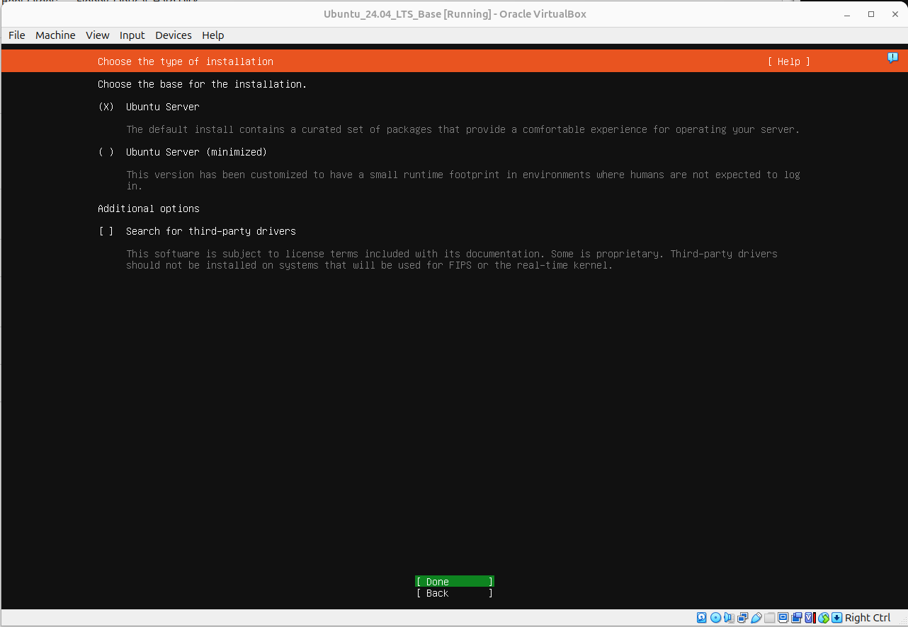

#### ⑤ 'enp0s3' → 'Edit IPv4' → 설정 정보 입력

- IPv4 Method : Manual
- Subnet : 10.0.0.0/16
- Address : 10.0.0.250
- Gateway : 10.0.0.1
- Name server : 10.0.0.1
- Search domains : -

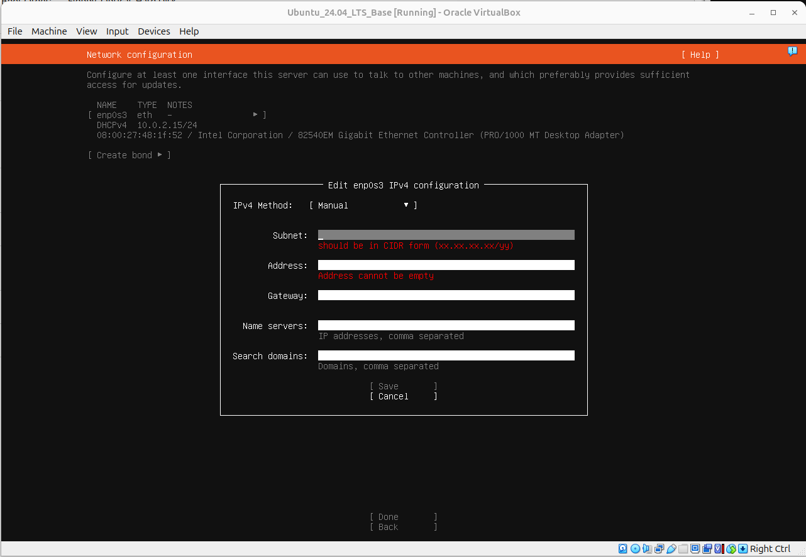

#### ⑥ 'Proxy address' PASS → 'Mirror address' PASS → 'disk' PASS

#### ⑦ 'ubuntu-lv' 항목 선택 → 'Edit' → 설정 정보 입력

- Size : 22.996G
- Format : xfs

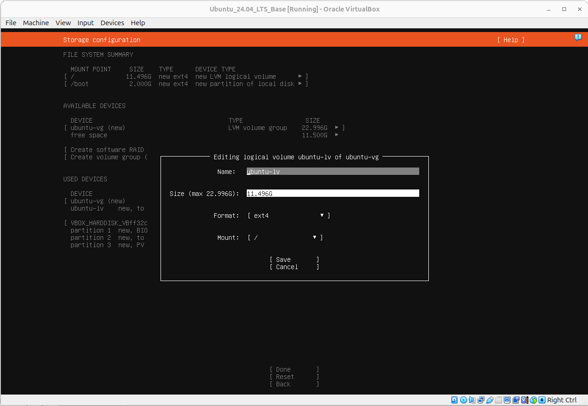

#### ⑧ Server 정보 입력

- Your name : sh1517.you
- Your servers name : ubuntu_base
- Pick a username : ubuntu
- Choose a password : qwer1234
- Confirm your password : qwer1234

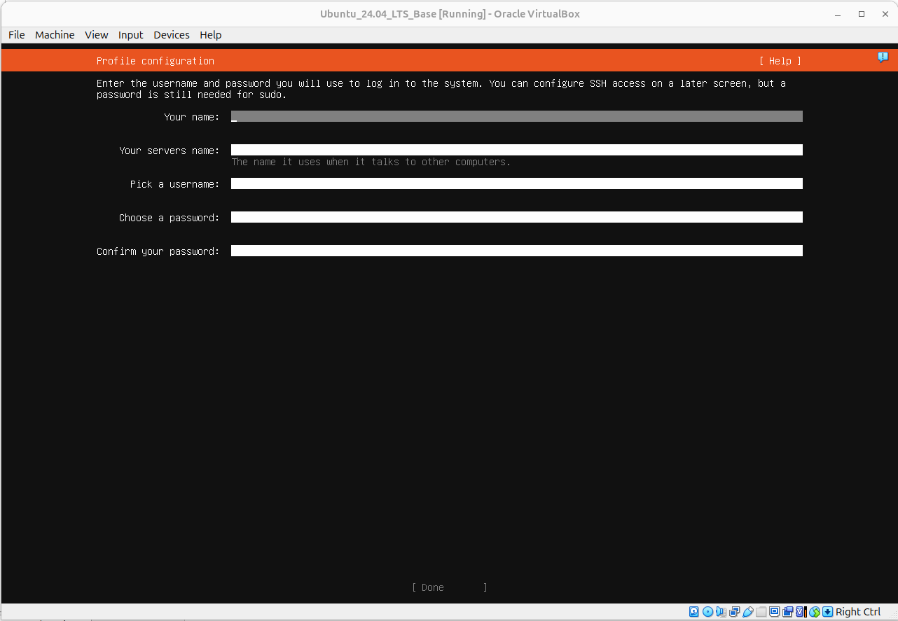

#### ⑨ 'Skip for now' 선택 → 'Install OpenSSH server' 선택 → 설치 시작

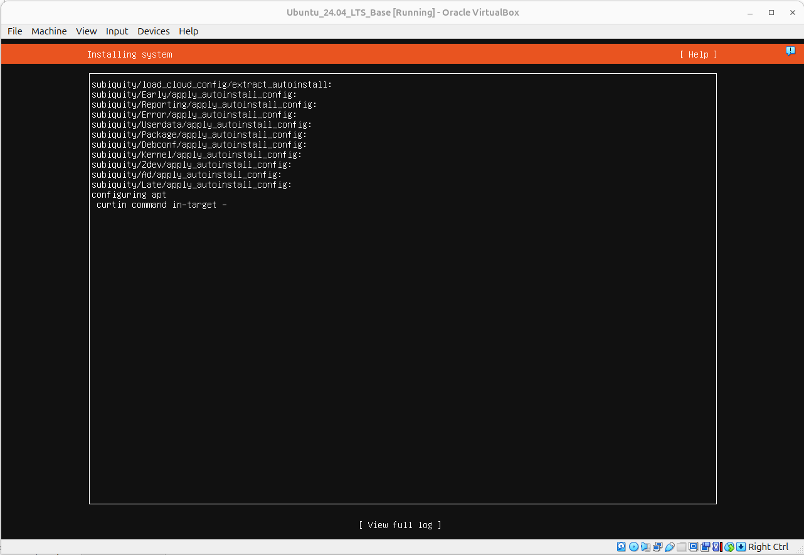

## VirtualBox에 쿠버네티스 클러스터 구성

### 1. Ubuntu Base IMAGE setting

#### ① 기본 도구 설치

```bash
apt update -y
apt install -y openssh-server curl tree vim
```

#### ② IP 설정 및 적용

```yaml
# vim /etc/netplan/50-cloud-init.yaml
network:
  version: 2
  ethernets:
    enp0s3:
      addresses:
        - 10.0.0.250/16
      gateway4: 10.0.0.1
      nameservers:
        addresses: [10.0.0.1]
```

```bash
netplan apply
```

#### ③ Pem key 설정

```bash
ssh-keygen -t rsa -b 2048 -f ubuntu.pem
mv ./ubuntu.pem.pub ~/.ssh/authorized_keys
```

### 2. master, node clone setting

#### ① IP setting

```
master 10.0.0.10 127.0.0.1 8022
node01 10.0.0.11 127.0.0.1 8023
node02 10.0.0.12 127.0.0.1 8024
```

- lvm extend

```bash
lvextend -l +100%FREE /dev/ubuntu-vg/ubuntu-lv
```

- partition exten

```bash
resize2fs /dev/ubuntu-vg/ubuntu-lv
```

### 3. kubespary (kuberbetes install)

- hosts

```bash
# /etc/hosts
10.0.0.10 master.example.com master
10.0.0.11 master.example.com node01
10.0.0.12 master.example.com node02
```

- pip install

```bash
sudo apt update -y
sudo apt install python3-pip -y
```

- kubespray install

```bash
git clone https://github.com/kubernetes-sigs/kubespray.git
cd kubespray
git checkout -b v2.26
sudo pip install -r requirements.txt --break-system-packages --ignore-installed
```

- configure cluster information

```bash
cp -rfp inventory/sample/ inventory/cluster
export ANSIBLE_PRIVATE_KEY_FILE=~/.ssh/ubuntu.pem
```

- ini configuration

```bash
# inventory/cluster/inventory.ini
[all]
master ansible_host=10.0.0.10   ip=10.0.0.10  etcd_member_name=etcd1
node01 ansible_host=10.0.0.11  ip=10.0.0.11
node02 ansible_host=10.0.0.12  ip=10.0.0.12

[kube_control_plane]
master

[etcd]
master

[kube_node]
node01
node02

[calico_crr]

[k8s_cluster:children]
kube_control_plane
kube_node
calico_crr
```

- k8s-cluster.yml 파일에 버전 지정

```bash
# inventory/cluster/group_vars/k8s_cluster/k8s-cluster.yml
kube_version: 1.30.4
```

- etcd.yml 파일에 버전 지정

```bash
# inventory/cluster/group_vars/etcd.yml
etcd_version: 3.5.12
```

- kubernetes install

```bash
ansible-playbook -i inventory/cluster/inventory.ini -v --become  --become-user=root cluster.yml
```

---

### 4. metal lb install

(https://metallb.io/installation/)

- ARP 모드를 활성화

```bash
$ kubectl edit configmap -n kube-system kube-proxy
>>  strictARP: true
```

- Meltal lb install

```bash
kubectl apply -f https://raw.githubusercontent.com/metallb/metallb/v0.14.9/config/manifests/metallb-native.yaml
```

- define ip pool & l2 layer

```yaml
# metal-lb-config.yaml
apiVersion: metallb.io/v1beta1
kind: IPAddressPool
metadata:
  name: metal-ip-pool
  namespace: metallb-system
spec:
  addresses:
    - 10.0.0.100-10.0.0.110
---
apiVersion: metallb.io/v1beta1
kind: L2Advertisement
metadata:
  name: metal-adv
  namespace: metallb-system
spec:
  ipAddressPools:
    - metal-ip-pool
```

- nginx ingress controller

```bash
kubectl apply -f https://raw.githubusercontent.com/kubernetes/ingress-nginx/controller-v1.10.1/deploy/static/provider/cloud/deploy.yaml
```

---

### 5. private registry

- docker install

```bash
apt update -y
apt install docker.io -y
systemctl start docker
usermod -a -G docker $USER
chown root:docker /var/run/docker.sock
```

- nexus start in container

```bash
cd ~
mkdir nexus-directory
sudo chown -R 200 nexus-directory
docker run -d -p 8081:8081 -p 8082:8082  --name nexus --restart=always -v ~/nexus-directory:/nexus-data sonatype/nexus3:latest
```

- nexus password check

```bash
docker exec -it nexus /bin/bash
cat /nexus-data/admin.password

- nexus access test (in nexkins server)
vim /etc/docker/daemon.json
{
	"insecure-registries" : [ "10.0.0.20:8082" ]
}
systemctl restart docker
docker login -u admin 10.0.0.20:8082
```

---

### 6. node server private registry sign

- containerd install

```bash
apt install containerd -y
```

- containerd setting

```bash
# /etc/containerd/config.toml
version = 2   # version 2로 수정
...
# plugins 항목 하단에 아래 내용 추가
[plugins."io.containerd.grpc.v1.cri".registry]
  [plugins."io.containerd.grpc.v1.cri".registry.mirrors]
    [plugins."io.containerd.grpc.v1.cri".registry.mirrors."10.0.0.20:8082"]
      endpoint = ["http://10.0.0.20:8082"]
  [plugins."io.containerd.grpc.v1.cri".registry.configs]
    [plugins."io.containerd.grpc.v1.cri".registry.configs."10.0.0.20:8082".tls]
      insecure_skip_verify = true
```

---

### 7. jenkins install

- jenkins install

```bash
sudo wget -O /usr/share/keyrings/jenkins-keyring.asc https://pkg.jenkins.io/debian-stable/jenkins.io-2023.key
echo "deb [signed-by=/usr/share/keyrings/jenkins-keyring.asc]" https://pkg.jenkins.io/debian-stable binary/ | sudo tee /etc/apt/sources.list.d/jenkins.list > /dev/null
sudo apt install openjdk-17-jdk -y
sudo apt install jenkins maven -y
```

- jenkins start

```bash
systemctl enable jenkins
systemctl start jenkins
```

- jenkins setting

```bash
usermod -a -G docker jenkins
chmod 666 /var/run/docker.sock
```

- jenkins password check

```bash
cat /var/lib/jenkins/secrets/initialAdminPassword
```

- jenkins recomanded plugin install

- jenkins additional plugin install
  - Docker Pipeline
  - Docker Commons
  - Pipeline: Stage View
  - Build Timestamp

---

### 8. jenkins settings

- SCM SSH setting (Jenkins GitHub Connection)
  (SCM SSH : https://10cheon00.tistory.com/4)

- Nexus and GitHub Credential asign

- jenkins pipeline setting
  (file : cicd_sample/node-app/Jenkinsfile)
  (handbook : https://www.jenkins.io/doc/book/getting-started/)

### 9. ArgoCD install

- ArgoCD install

```bash
kubectl create namespace argocd
kubectl apply -n argocd -f https://raw.githubusercontent.com/argoproj/argo-cd/stable/manifests/install.yaml
kubectl patch svc argocd-server -n argocd -p '{"spec": {"type":"LoadBalancer"}}'
```

- ArgoCD CLI install

```bash
curl -sSL -o argocd-linux-amd64 https://github.com/argoproj/argo-cd/releases/latest/download/argocd-linux-amd64
sudo install -m 555 argocd-linux-amd64 /usr/local/bin/argocd
rm argocd-linux-amd64
```

- ArgoCD Password check

```bash
argocd admin initial-password -n argocd
```

---

### 10. helm

- helm install

```bash
$ curl -fsSL -o get_helm.sh https://raw.githubusercontent.com/helm/helm/main/scripts/get-helm-3
$ chmod 700 get_helm.sh
$ ./get_helm.sh
```

---

### 11. DB Images

- create docker file (postgresql 16.5)

```bash
docker build -t 10.0.0.20:8082/db:v1.0.0
docker push 10.0.0.20:8082/db:v1.0.0
```

- openebs install

```bash
kubectl apply -f https://openebs.github.io/charts/openebs-operator.yaml
kubectl patch sc -n openebs openebs-hostpath -p '{"metadata": {"annotations":{"storageclass.kubernetes.io/is-default-class":"true"}}}'
```

- create manifest

- kubernetes resource test

```bash
ka statefuleset-db.yaml
ka secret-db.yaml
ka service-db.yaml
```

- access test

```bash
k exec -it sts-postgres-db-0 -- su - postgres -c psql
\l
# node table 생성 여부 확인
```

### 12. Argo CD Webhook Setting

- https://dobby-isfree.tistory.com/216
