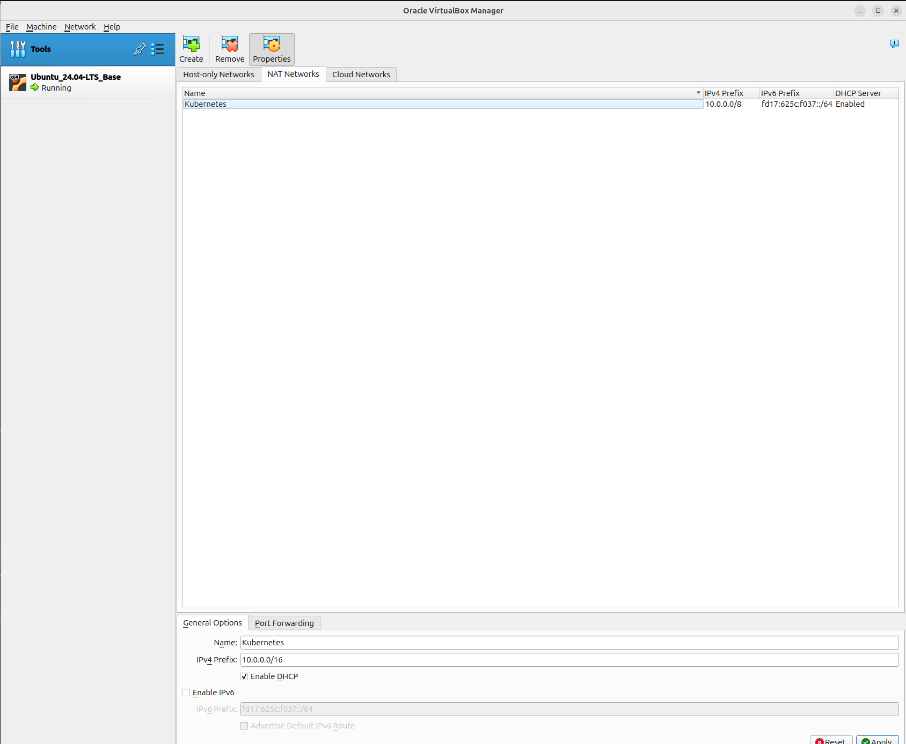
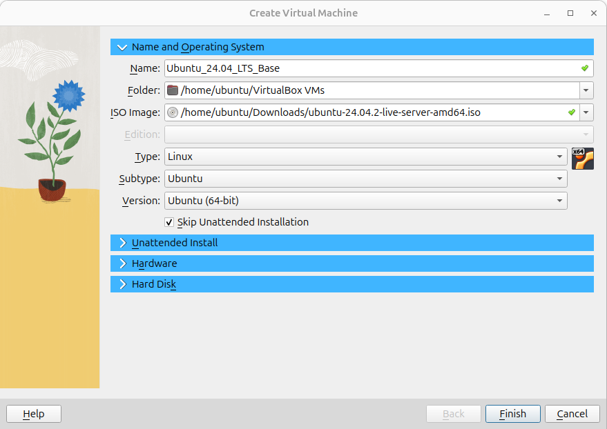
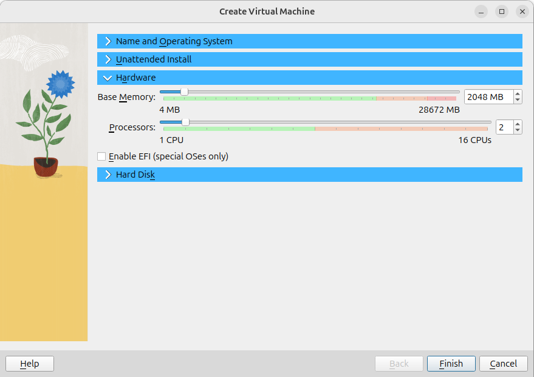
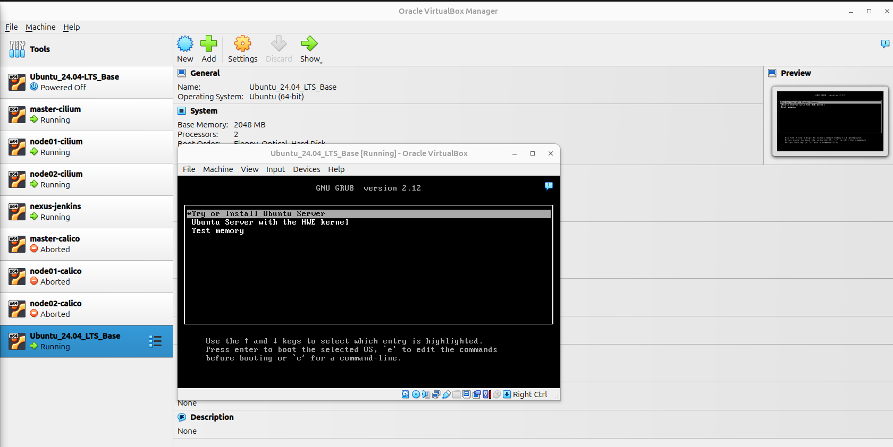
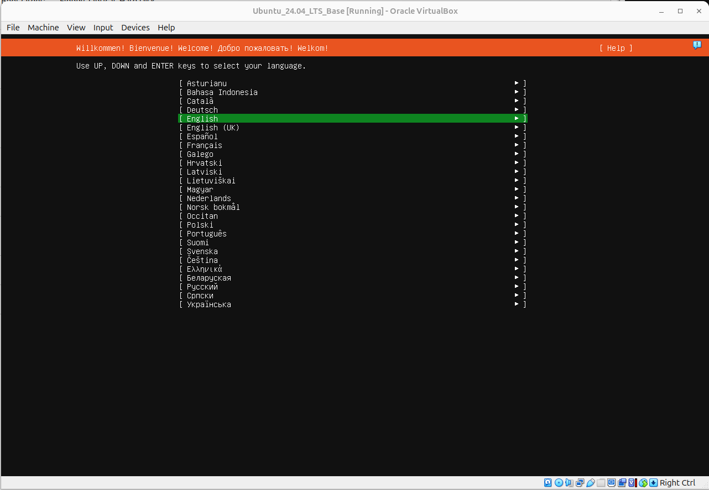
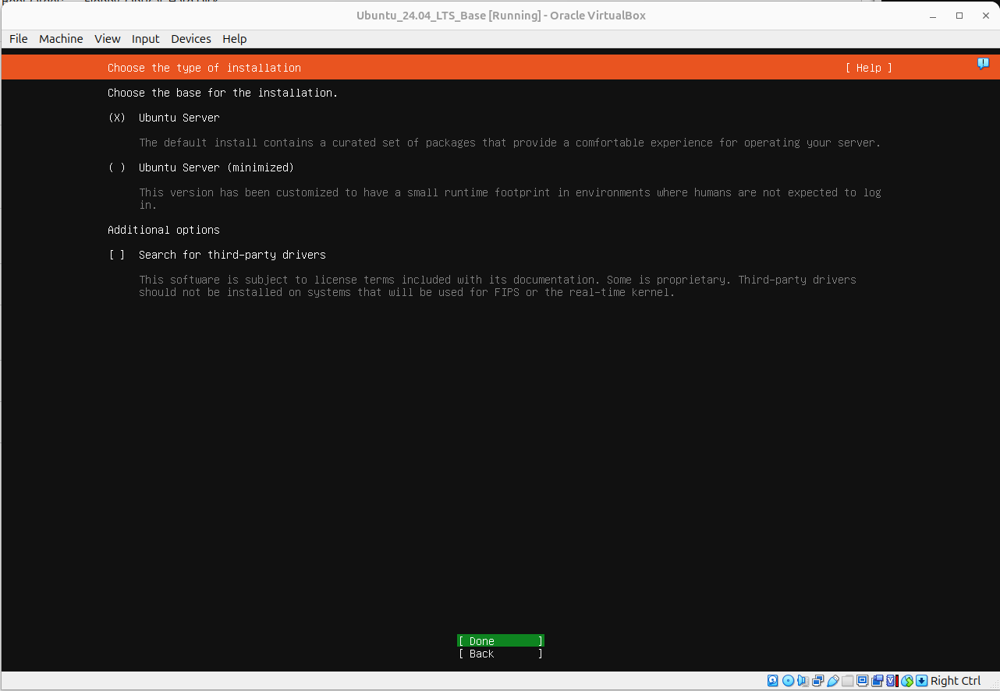
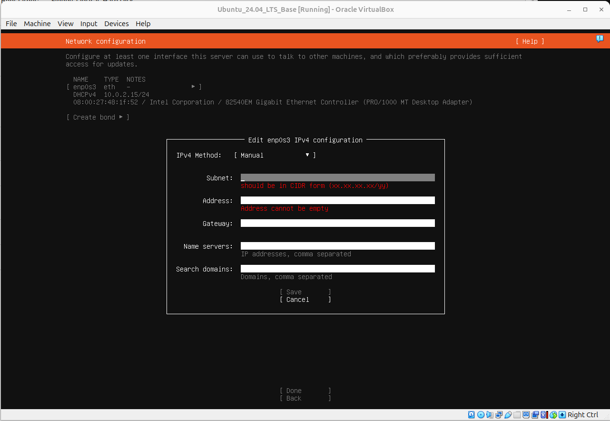
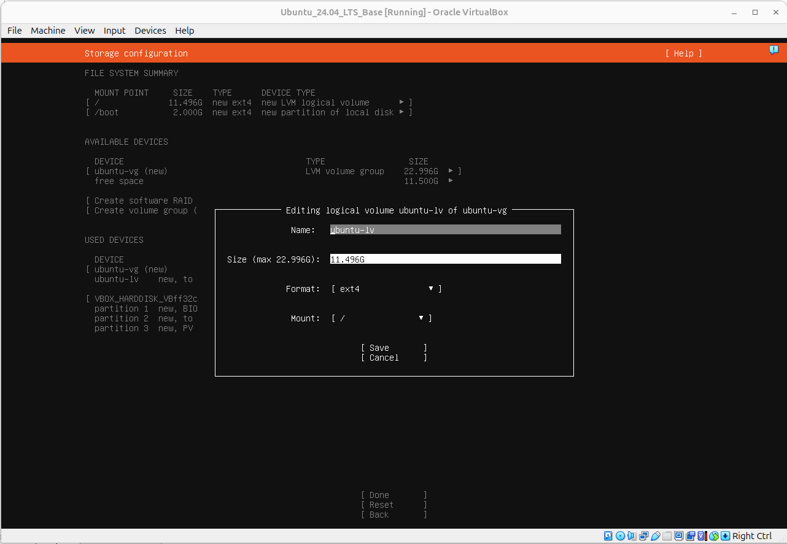
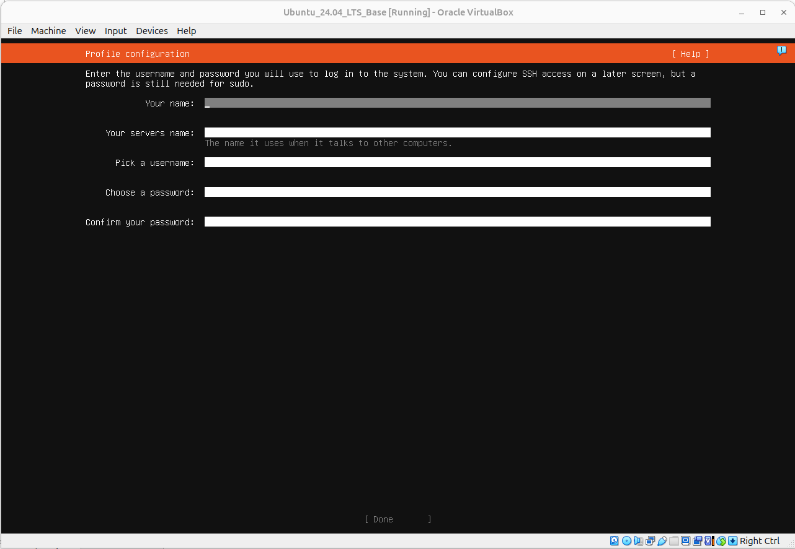
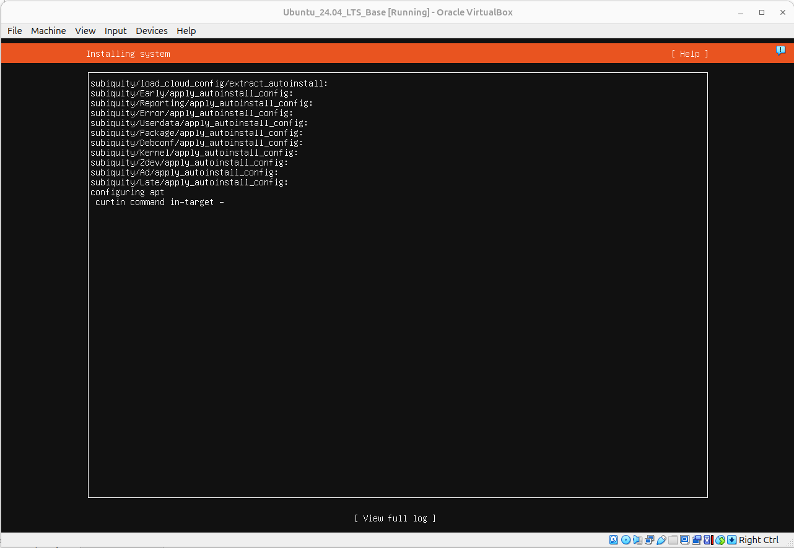

## VirtualBox 구성

Virtual Box를 이용해 7대의 VM을 생성한 후 1대의 VM에 Nexus와 Jenkins를 구성, 각각 3대의 VM에 Calico CNI, Cilium CNI 기반 쿠버네티스 클러스터를 구성하는 방법을 정리

### 1. 파일 다운로드

- VirtualBox (latest) : https://www.virtualbox.org/wiki/Downloads

- Ubuntu 24.04-LTS Server Image : https://ubuntu.com/download/server

### 2. Virtual Box Network 설정

#### 2.1 Network 종류

Vitual Box에서는 Nat, Bridge Adapter, Host-Only Adapter, Nat Network 등의 네트워크 어댑터를 지원한다. 각 네트워크 어댑터의 특징은 아래와 같다.

**① NAT**

- Description : 호스트 PC의 IP를 통해 외부와 통신을 지원하는 어댑터
- Features :
  - VM에서 외부로 나가는 트래픽만 허용
  - VM 간의 통신 제한
  - 포트 포워딩 설정을 통해 외부에서 VM으로 접속
- Usage :
  - VM이 외부(인터넷) 접속만 필요한 경우 사용

**② NAT Network**

- Description : NAT Adapter를 할당 받은 VM들을 하나의 네트워크로 묶어주는 어댑터
- Features :
  - 같은 네트워크에 속한 VM 간 통신 가능
  - VM에서 외부로 나가는 트래픽 허용
  - 포트 포워딩을 통해 외부에서 VM으로 접속
- Usage :
  - 다수의 VM을 이용해 클러스터를 구성하기위해 VM간 통신이 필요하면서 외부와의 통신이 필요한 경우 사용

**③ Bridge Adapter**

- Description : 호스트 PC와 동일한 네트워크에 있는 독립적인 컴퓨터처럼 동작하게 해주는 어댑터
- Features :
  - 호스트가 연결된 네트워크 라우터(공유기)로 부터 직접 IP 할당
  - 호스트 PC와 같은 네트워크에 속한 다른 장치들과 VM 간의 통신 가능
- Usage : VM에서 실행되는 App, DB 서비스가 같은 네트워크에 속한 다른 장치들과 통신이 필요할 경우 사용

**④ Host-Only Adapter**

- Description : 호스트 PC와 VM간의 통신만 가능한 네트워크 어댑터
- Features :
  - 외부 인터넷과 연결 제한
  - 호스트 PC와 VM 사이의 통신만 가능
- Usage : 호스트 PC와 VM 간에 파일을 공유하거나, 외부와는 격리된 안전한 테스트 환경을 만들고 싶을 때 사용

**⑤ Internal Network**

- Description : VM 간의 통신만 지원하는 네트워크 어댑터
- Features :
  - 호스트 PC에서도 접근 불가
  - 외부 인터넷과 연결 제한
- Usage: 외부와 완전히 차단된 환경에서 VM 간의 통신을 테스트할 때 사용

#### 2.2 Network 설정

Tools → NAT Networks → Create → 설정 정보 입력

- Name: Kubernetes

- IPv4 Prefix : 10.0.0.0/8



### 3. Base Image 생성

다운로드 받은 우분투 OS 설치를 마친 베이스 이미지를 만들어 두면 쿠버네티스 클러스터 구성에 필요한 VM을 복제하여 활용할 수 있다. 작업 과정에 추가 노드를 만들어야 하거나 초기화가 필요할 경우 베이스 이미지를 만들어 두지 않으면, OS 설치 과정부터 다시 시작해야 한다.

#### 3.1 VM 추가

**① Machine → new → 설정 정보 입력**

- Name : Ubuntu_24.04_LTS_Base

- ISO Image : _<다운로드 받은 Ubuntu 24.04 이미지 파일 선택>_

- Skip Unattended Installation 체크



**② 'Unattended Install' Skip**

**③ 'Hardware' 설정 정보 입력**

- Processros : 2

- Memory : 2048 ~ 4096 MB



**④ 'Hard Disk' Skip**

**⑤ Finish 버튼 클릭**

#### 3.2 VM 추가

**① 'Ubuntu_24.04_LTS_Base' VM 더블 클릭 → 'Try or Install Ubuntu Server' 선택**



**② English 선택**



**③ 'Korean' 선택**


**④ 'Ubuntu Server' 선택**



**⑤ 'enp0s3' → 'Edit IPv4' → 설정 정보 입력**

- IPv4 Method : Manual
- Subnet : 10.0.0.0/16
- Address : 10.0.0.250
- Gateway : 10.0.0.1
- Name server : 10.0.0.1
- Search domains : -



**⑥ 'Proxy address' PASS → 'Mirror address' PASS → 'disk' PASS**

**⑦ 'ubuntu-lv' 항목 선택 → 'Edit' → 설정 정보 입력**

- Size : 22.996G
- Format : xfs



**⑧ Server 정보 입력**

- Your name : sh1517.you
- Your servers name : ubuntu_base
- Pick a username : ubuntu
- Choose a password : qwer1234
- Confirm your password : qwer1234



**⑨ 'Skip for now' 선택 → 'Install OpenSSH server' 선택 → 설치 시작**



### 4. Ubuntu Base IMAGE setting

#### 1.1 기본 도구 설치

```bash
apt update -y
apt install -y openssh-server curl tree vim
```

#### 1.2 IP 설정 및 적용

```yaml
# vim /etc/netplan/00-installer-config.yaml
network:
  version: 2
  ethernets:
    enp0s3:
      addresses:
        - 10.0.0.250/16
      nameservers:
        addresses: [10.0.0.1]
        search: []
      routes:
        - to: default
          via: 10.0.0.1
```

```bash
netplan apply
```

#### 1.3 Pem key 설정

```bash
cd ~
ssh-keygen -t rsa -b 2048 -f ubuntu.pem
mv ./ubuntu.pem ~/.ssh/
mv ./ubuntu.pem.pub ~/.ssh/authorized_keys
```

#### 1.4 Timezone 설정

```bash
sudo timedatectl set-timezone 'Asia/Seoul'
```
