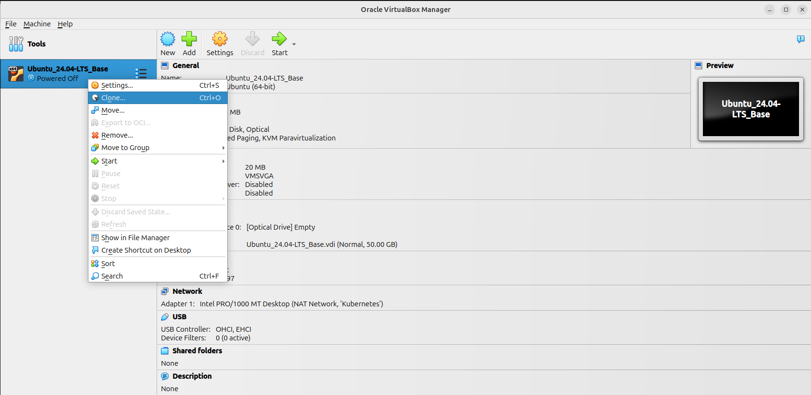
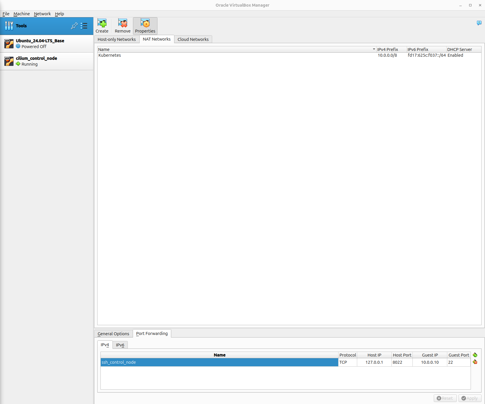

## VirtualBox에 쿠버네티스 클러스터 구성 (with kubeadm)

### 1. Control Node 이미지 복제

#### 1.1 Ubuntu Base Images 우클릭 → 'Clone'



#### 1.2 설정정보 입력

- 이름: cilium_control_node

- MAC Address Policy : 'Generate new MAX addresses for all network adapters' → 'Finish'


#### 1.3 IP 설정 및 적용

```yaml
# vim /etc/netplan/00-installer-config.yaml
network:
  version: 2
  ethernets:
    enp0s3:
      addresses:
        - 10.0.0.10/16
      nameservers:
        addresses: [10.0.0.1]
        search: []
      routes:
        - to: default
          via: 10.0.0.1
```

```bash
netplan apply
```

#### 1.4 HostName 설정

```bash
hostnamectl set-hostname control
```

#### 1.5 hosts 파일 설정

```bash
# /etc/hosts
10.0.0.10 control.example.com control
10.0.0.11 node01.example.com node01
10.0.0.12 node02.example.com node02
```

#### 1.6 VirtualBox Nat Network 설정

Tools → NAT Networks → 'Kubernetes' → 'Port Forwarding' → 포워딩 정보 입력

|        Name        | Protocol |  Host IP  | Host Port | Guest IP  | Guest Port |
| :----------------: | :------: | :-------: | :-------: | :-------: | :--------: |
|  ssh_control_node  |   TCP    | 127.0.0.1 |   8022    | 10.0.0.10 |     22     |
| ssh_worker_node_01 |   TCP    | 127.0.0.1 |   8023    | 10.0.0.11 |     22     |
| ssh_worker_node_02 |   TCP    | 127.0.0.1 |   8024    | 10.0.0.12 |     22     |



### 2. Kubernetes Control Node 구성

#### 2.1 필수 패키지 설치

```bash
apt update -y
apt install -y curl gnupg gnupg2 apt-transport-https ca-certificates software-properties-common vim git wget lsb-release uidmap
```

#### 2.2 SWAP OFF 설정

**① 쿠버네티스에서 SWAP 기능을 비활성화 하는 이유**

- 물리적인 메모리한 이용해 자원을 관리하여 메모리의 일관성을 유지한다.

- SWAP 활성화된 상태에서는 물리 메모리의 부족한 상황을 정확하게 감지할 수 없다.

- SWAP을 쓰게 될 경우 메모리 대비 디스크의 성능이 현저히 느리기 때문에 성능이 떨어진다.

- 운영 과정에 노드의 실제 메모리 사용량 외에 SWAP 공간까지 고려해야 하기 때문에 사용량 예측이 어려워 진다.

- 컨테이너를 SWAP 공간으로 이동했다가 다시 로드하는 과정에 문제가 발생할 수 있다.

**② SWAP 비활성화**

```bash
swapoff -a
```

#### 2.3 커널 네트워크 설정

```bash
# /etc/sysctl.d/kubernetes.conf
net.bridge.bridge-nf-call-ip6tables=1
net.bridge.bridge-nf-call-iptables=1
net.ipv4.ip_forward=1
```

```bash
# 모듈 자동 로드 설정
cat <<EOF | sudo tee /etc/modules-load.d/k8s.conf
overlay
br_netfilter
EOF

# 즉시 모듈 로드
sudo modprobe overlay
sudo modprobe br_netfilter
```

#### 2.4 Containerd 설치

```bash
install -m 0755 /etc/apt/keyrings
curl -fsSL https://download.docker.com/linux/ubuntu/gpg -o /etc/apt/keyrings/docker.asc
chmod a+r /etc/apt/keyrings/docker.asc
echo "deb [arch=$(dpkg --print-architecture) signed-by=/etc/apt/keyrings/docker.asc] https://download.docker.com/linux/ubuntu $(. /etc/os-release && echo $VERSION_CODENAME) stable" | tee /etc/apt/sources.list.d/docker.list > /dev/null
apt update -y
apt install -y containerd.io
```

#### 2.5 crictl 설치

```bash
# 최신 버전 확인 후 다운로드
VERSION="v1.28.0"  # 원하는 버전으로 변경
wget https://github.com/kubernetes-sigs/cri-tools/releases/download/$VERSION/crictl-$VERSION-linux-amd64.tar.gz

# 압축 해제 및 설치
sudo tar zxvf crictl-$VERSION-linux-amd64.tar.gz -C /usr/local/bin
rm -f crictl-$VERSION-linux-amd64.tar.gz
```

#### 2.6 Containerd 설정

```bash
containerd config default | tee /etc/containerd/config.toml
sed -e 's/SystemdCgroup = false/SystemdCgroup = true/g' -i /etc/containerd/config.toml
crictl config --set runtime-endpoint=unix:///run/containerd/containerd.sock --set image-endpoint=unix:///run/containerd/containerd.sock
```

#### 2.7 쿠버네티스 설치

```bash
# google gpg key download
curl -fsSL https://pkgs.k8s.io/core:/stable:/v1.32/deb/Release.key | sudo gpg --dearmor -o /etc/apt/keyrings/kubernetes-apt-keyring.gpg

# kubernetes repo setting
echo 'deb [signed-by=/etc/apt/keyrings/kubernetes-apt-keyring.gpg] https://pkgs.k8s.io/core:/stable:/v1.32/deb/ /' | sudo tee /etc/apt/sources.list.d/kubernetes.list

# install kubeadm kubelet kubectl
apt update
apt install -y kubeadm kubelet kubectl

# package version holding
apt-mark hold kubelet kubeadm kubectl
```

### 3. Kubernetes Worker Node 구성

#### 3.1 Control Node → Worker Node 01, 02 복제

- Control Node 종료

- Control Node 이미지 우클릭 → 'Clone'

- 설정 정보 입력

  - Worker Node 01

    - 이름: cilium_worker_node_01

    - MAC Address Policy : 'Generate new MAX addresses for all network adapters' → 'Finish'

  - Worker Node 02

    - 이름: cilium_worker_node_02

    - MAC Address Policy : 'Generate new MAX addresses for all network adapters' → 'Finish'

#### 3.2 IP 설정 및 적용

- Worker Node 01

  ```yaml
  # vim /etc/netplan/00-installer-config.yaml
  network:
    version: 2
    ethernets:
      enp0s3:
        addresses:
          - 10.0.0.11/16
        nameservers:
          addresses: [10.0.0.1]
          search: []
        routes:
          - to: default
            via: 10.0.0.1
  ```

  ```bash
  netplan apply
  ```

- Worker Node 02

  ```yaml
  # vim /etc/netplan/00-installer-config.yaml
  network:
    version: 2
    ethernets:
      enp0s3:
        addresses:
          - 10.0.0.12/16
        nameservers:
          addresses: [10.0.0.1]
          search: []
        routes:
          - to: default
            via: 10.0.0.1
  ```

  ```bash
  netplan apply
  ```

#### 1.4 HostName 설정

- Worker Node 01

  ```bash
  hostnamectl set-hostname node01
  ```

- Worker Node 02

  ```bash
  hostnamectl set-hostname node02
  ```

### 4. Kubernetes Cluster 구성

#### 4.1 kubeadm config 파일 구성

```yaml
# kubeadm-config.yaml
# https://kubernetes.io/docs/reference/config-api/kubeadm-config.v1beta3/
apiVersion: kubeadm.k8s.io/v1beta3
kind: InitConfiguration
skipPhases:
  - addon/kube-proxy
---
apiVersion: kubeadm.k8s.io/v1beta3
kind: ClusterConfiguration
kubernetesVersion: v1.32.6
controlPlaneEndpoint: control:6443
networking:
  podSubnet: 10.100.0.0/16
  serviceSubnet: 10.200.0.0/16
```

#### 4.2 클러스터 구성

```bash
# kube proxy 없이 구성할 때는 '--skip-phases=addon/kube-proxy' 옵션 추가
# Control Node를 이중화 구성할 경우 '--upload-certs'  옵션 추가
sudo kubeadm init --config=kubeadm-config.yaml | tee kubeadm-init.log
```

#### 4.3 kubectl 설정

```bash
mkdir -p $HOME/.kube
sudo cp -i /etc/kubernetes/admin.conf $HOME/.kube/config
sudo chown $(id -u):$(id -g) $HOME/.kube/config
```

#### 4.4 Worker Node 01, 02 클러스터에 추가

- Worker Node 01, 02에서 root 권한으로 각 명령어 수행

```bash
# kubeadm init 실행 결과에 나오는 명령어 이용
kubeadm join control:6443 --token ***... --discovery-token-ca-cert-hash sha256:***...
```

#### 4.5 설치 결과 확인 (control node에서 실행)

```bash
root@control:~# kubectl get nodes
NAME      STATUS     ROLES           AGE     VERSION
control   NotReady   control-plane   2m18s   v1.32.6
node01    NotReady   <none>          27s     v1.32.6
node02    NotReady   <none>          15s     v1.32.6

root@control:~# kubectl get po -A
NAMESPACE     NAME                              READY   STATUS    RESTARTS   AGE
kube-system   coredns-668d6bf9bc-frzs2          0/1     Pending   0          2m17s
kube-system   coredns-668d6bf9bc-q5zwl          0/1     Pending   0          2m17s
kube-system   etcd-control                      1/1     Running   0          2m24s
kube-system   kube-apiserver-control            1/1     Running   0          2m24s
kube-system   kube-controller-manager-control   1/1     Running   0          2m24s
kube-system   kube-scheduler-control            1/1     Running   0          2m24s
```
