## GitOps Tools 설치

### 1. ArgoCD

#### 1.1 ArgoCD install

```bash
kubectl create namespace argocd
kubectl apply -n argocd -f https://raw.githubusercontent.com/argoproj/argo-cd/stable/manifests/install.yaml
kubectl patch svc argocd-server -n argocd -p '{"spec": {"type":"LoadBalancer"}}'
```

#### 1.2 ArgoCD CLI install

```bash
# Timeout으로 제대로 설치가 안될 경우 "--connect-timeout 30 --max-time 300" 옵션 추가
curl -sSL -o argocd-linux-amd64 https://github.com/argoproj/argo-cd/releases/latest/download/argocd-linux-amd64
sudo install -m 555 argocd-linux-amd64 /usr/local/bin/argocd
rm argocd-linux-amd64
```

#### 1.3 ArgoCD Password check

```bash
argocd admin initial-password -n argocd
```

#### 1.4 외부 접속 설정

**argocd server external ip 확인**

```bash
kubectl get svc -n argocd
```

**VirtualBox Nat Network 설정**

Tools → NAT Networks → 'Kubernetes' → 'Port Forwarding' → 포워딩 정보 추가

|        Name        | Protocol |  Host IP  | Host Port |          Guest IP           | Guest Port |
| :----------------: | :------: | :-------: | :-------: | :-------------------------: | :--------: |
|  ssh_control_node  |   TCP    | 127.0.0.1 |   8022    |          10.0.0.10          |     22     |
| ssh_worker_node_01 |   TCP    | 127.0.0.1 |   8023    |          10.0.0.11          |     22     |
| ssh_worker_node_02 |   TCP    | 127.0.0.1 |   8024    |          10.0.0.12          |     22     |
| web_argocd_server  |   TCP    | 127.0.0.1 |   10443   | <ARGOCD_SERVER_EXTERNAL_IP> |    443     |

#### 1.5 ArgoCD 접속 및 기본 설정

웹 브라우저 접속 (https://127.0.0.1:10443) → Advanced → Proceed to 127.0.0.1 (unsafe)

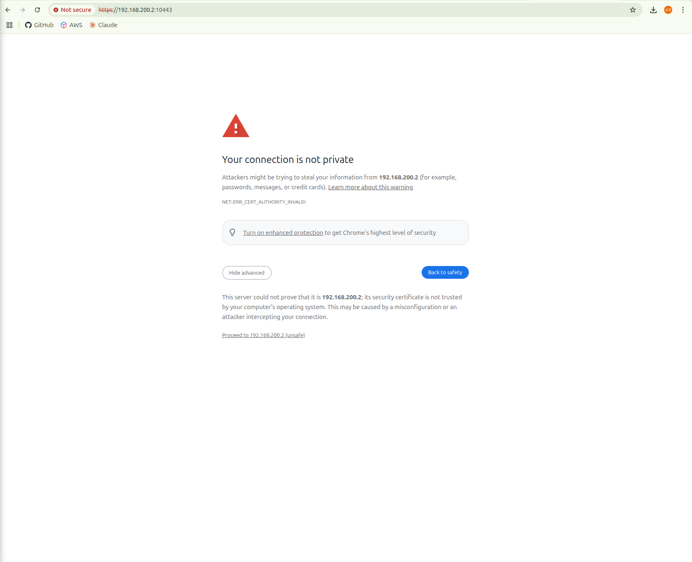

로그인 정보 입력 (ID: admin / PW: 1.3 단계에서 확인한 패스워드 입력)

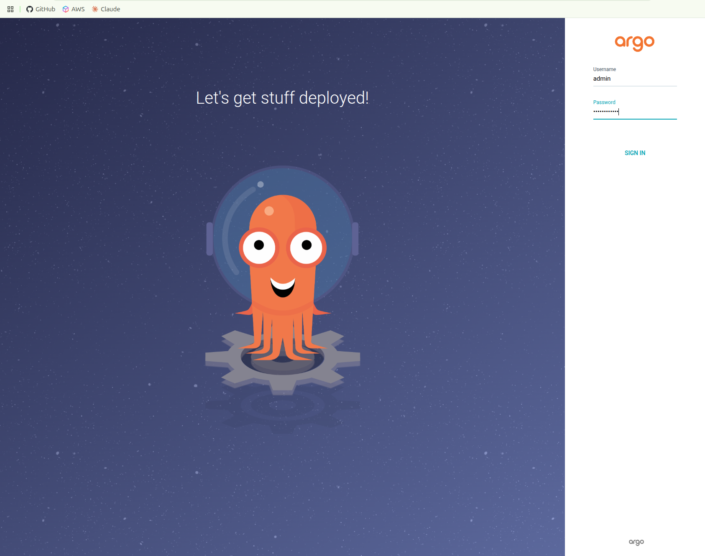

User Info → UPDATE PASSWORD → 비밀번호 변경

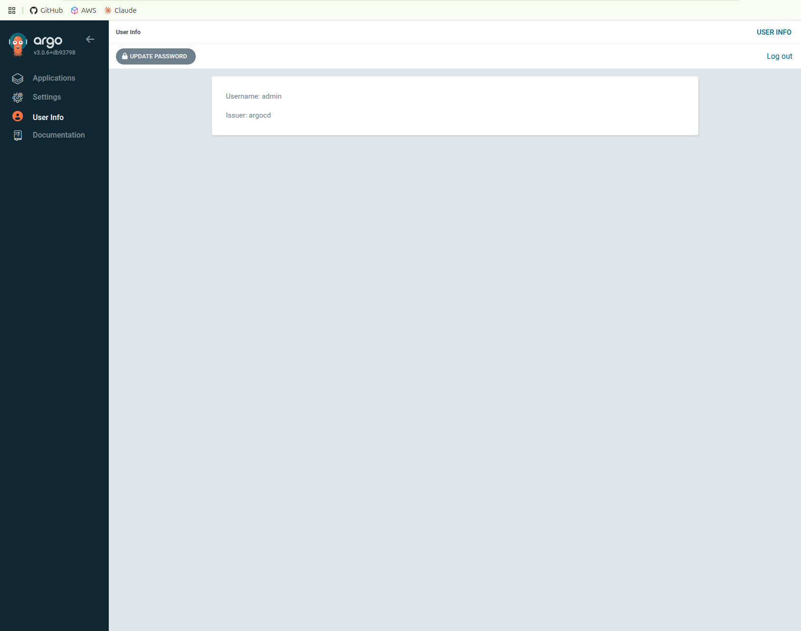

#### 1.6 GitHub Reposigory 등록

Settings → Repositories

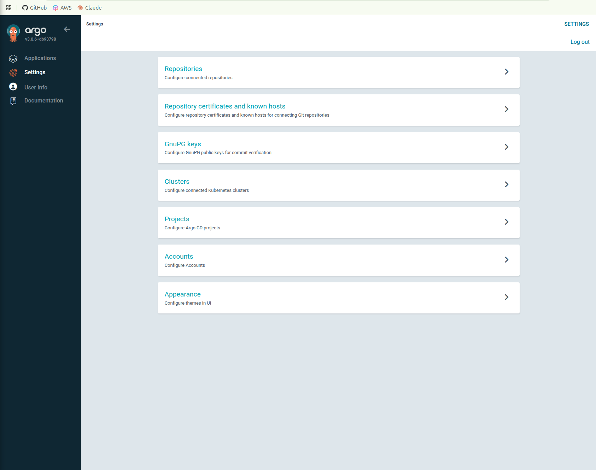

CONNECT REPO → 설정 정보 입력 → CONNECT 클릭

- Choose your connection method: VIA HTTPS

- Name : <option>

- Project : <option>

- Repository URL : GITHUB_MANIFEST_REPOSITORY_URL

- Username : PERSONAL_ID

- Password : GITHUB_ACCESS_TOKEN_KEY

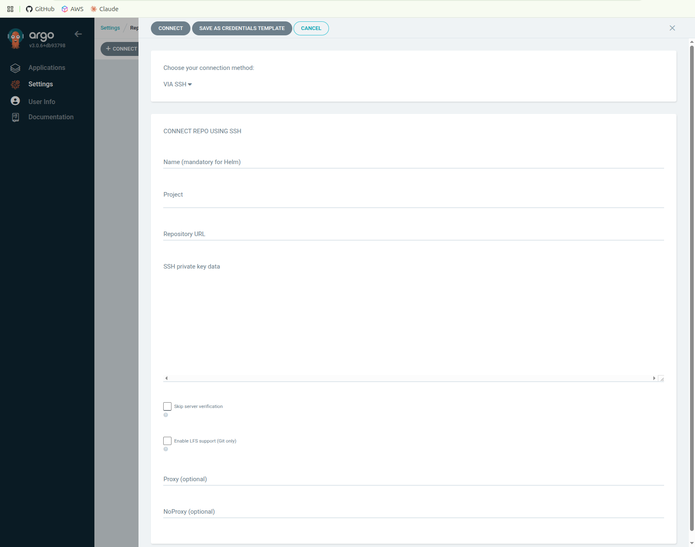

### 2. Private Registry 구성

#### 2.1 VirtualBox VM 복제

- Ubuntu Base Images 우클릭 → 'Clone'

- 설정 정보 입력

  - 이름: gitops_tools_node

  - MAC Address Policy : 'Generate new MAX addresses for all network adapters' → 'Finish'

#### 2.2 IP 설정 및 적용

```bash
# vim /etc/netplan/00-installer-config.yaml
network:
  version: 2
  ethernets:
    enp0s3:
      addresses:
        - 10.0.0.20/16
      nameservers:
        addresses: [10.0.0.1]
        search: []
      routes:
        - to: default
          via: 10.0.0.1
```

#### 2.3 Hostname 설정

```bash
hostnamectl set-hostname gitops_node
```

#### 2.4 docker install

```bash
apt update -y
apt install docker.io -y
systemctl start docker
usermod -a -G docker $USER
chown root:docker /var/run/docker.sock
```

#### 2.5 Nexus 도커 컨테이너 실행

```bash
cd ~
mkdir nexus-directory
sudo chown -R 200 nexus-directory
docker run -d -p 8081:8081 -p 8082:8082  --name nexus --restart=always -v ~/nexus-directory:/nexus-data sonatype/nexus3:latest
```

#### 2.6 Nexus 패스워드 확인

```bash
docker exec -it nexus /bin/bash
cat /nexus-data/admin.password
```

#### 2.7 외부 접속 설정 (VirtualBox Nat Network 설정)

Tools → NAT Networks → 'Kubernetes' → 'Port Forwarding' → 포워딩 정보 추가

|        Name        | Protocol |  Host IP  | Host Port |          Guest IP           | Guest Port |
| :----------------: | :------: | :-------: | :-------: | :-------------------------: | :--------: |
|  ssh_control_node  |   TCP    | 127.0.0.1 |   8022    |          10.0.0.10          |     22     |
| ssh_worker_node_01 |   TCP    | 127.0.0.1 |   8023    |          10.0.0.11          |     22     |
| ssh_worker_node_02 |   TCP    | 127.0.0.1 |   8024    |          10.0.0.12          |     22     |
| web_argocd_server  |   TCP    | 127.0.0.1 |   10443   | <ARGOCD_SERVER_EXTERNAL_IP> |    443     |
| web_nexus_registry |   TCP    | 127.0.0.1 |   18081   |          10.0.0.20          |    8081    |

#### 2.8 Nexus 저장소 구성

**① 웹 브라우저에서 http://127.0.0.1:18081 접속 후 로그인 (로그인 후 관리자 패스워드 재설정)**

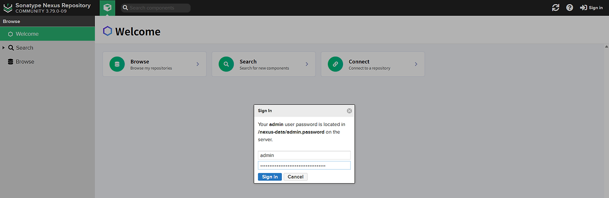

**② 설정 화면 → Repositories → Create repository 클릭**


**③ 화면에서 docker(hosted) 클릭**

**④ 저장소 설정 정보 입력**

- Name 입력

- HTTP 체크박스 체크 → 8082 입력

- 'Enable Docker V1 API' 체크 (호환성을 위해)

- Storage는 Default 유지

- 화면 하단으로 내려가 'Create repositry' 버튼 클릭

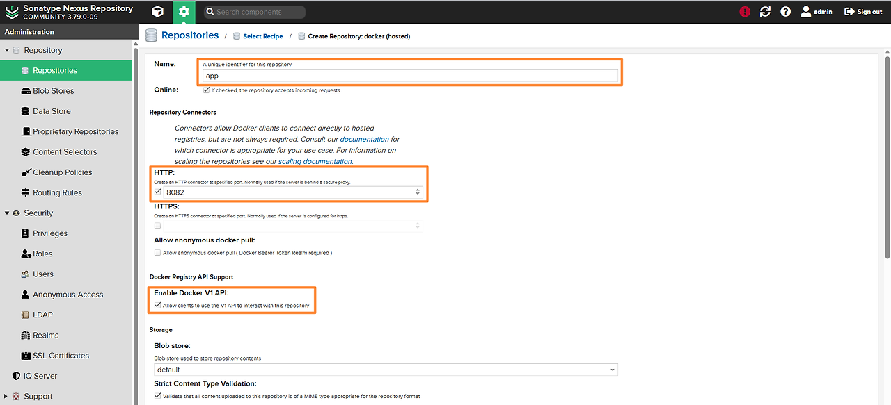

**⑤ Security - Realms 화면 이동 → Docker Bearer Token Realm 추가 → 저장 버튼 클릭**

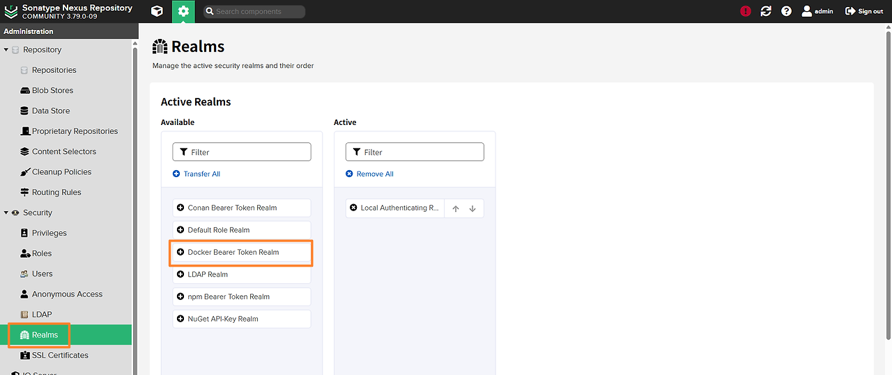

#### 2.9 nexus 접속 설정 (docker)

**Nexus 접속을 위한 HTTP 설정**

```bash
# /etc/docker/daemon.json
{
  "insecure-registries" : [ "10.0.0.20:8082" ]
}
```

**Nexus 접속을 위한 HTTP 설정**

```bash
systemctl restart docker
docker login -u admin 10.0.0.20:8082
```

#### 2.10 nexus 접속 설정 (containerd)

**containerd 설정**

```bash
# /etc/containerd/config.toml
version = 2   # version 2로 수정
...
# plugins 항목 하단에 아래 내용 추가
    # REGISTRY_SERVER_IP = 실제 IP로 변환
    [plugins."io.containerd.grpc.v1.cri".registry]
      [plugins."io.containerd.grpc.v1.cri".registry.mirrors]
        [plugins."io.containerd.grpc.v1.crt".registry.mirrors."docker.io"]
          endpoint = ["https://registry-1.docker.io"]
        [plugins."io.containerd.grpc.v1.cri".registry.mirrors."REGISTRY_SERVER_IP:8082"]
          endpoint = ["http://REGISTRY_SERVER_IP:8082"]

      [plugins."io.containerd.grpc.v1.cri".registry.headers]

      [plugins."io.containerd.grpc.v1.cri".registry.auths]

      [plugins."io.containerd.grpc.v1.cri".registry.configs]
        [plugins."io.containerd.grpc.v1.cri".registry.configs."REGISTRY_SERVER_IP:8082".tls]
          insecure_skip_verify = true
        [plugins."io.containerd.grpc.v1.cri".registry.configs."REGISTRY_SERVER_IP:8082".transport]
          plain_http = true
        [plugins."io.containerd.grpc.v1.cri".registry.configs."REGISTRY_SERVER_IP:8082".auth]
          # 인증정보
          username = "username"
          password = "password!"
```

### 3. jenkins 구성

#### 3.1 jenkins 설치

```bash
sudo wget -O /usr/share/keyrings/jenkins-keyring.asc https://pkg.jenkins.io/debian-stable/jenkins.io-2023.key
echo "deb [signed-by=/usr/share/keyrings/jenkins-keyring.asc]" https://pkg.jenkins.io/debian-stable binary/ | sudo tee /etc/apt/sources.list.d/jenkins.list > /dev/null
sudo apt update
sudo apt install openjdk-17-jdk -y
sudo apt install jenkins maven -y
```

#### 3.2 jenkins 실행

```bash
systemctl enable jenkins
systemctl start jenkins
```

#### 3.3 jenkins setting

```bash
usermod -a -G docker jenkins
chmod 666 /var/run/docker.sock
```

#### 3.4 jenkins password check

```bash
cat /var/lib/jenkins/secrets/initialAdminPassword
```

#### 3.5 jenkins 초기 설정

- 패스워드 입력

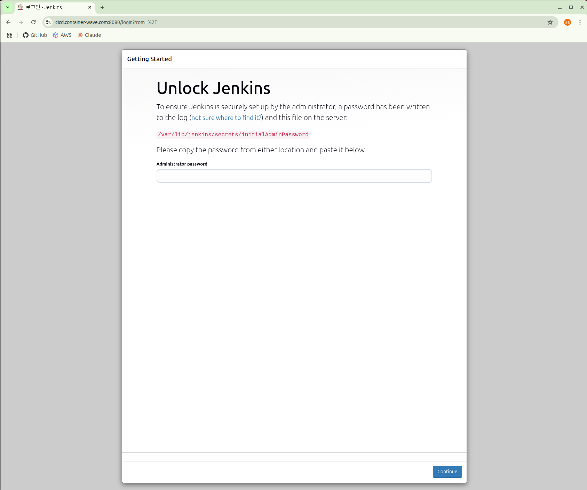

- 계정 설정

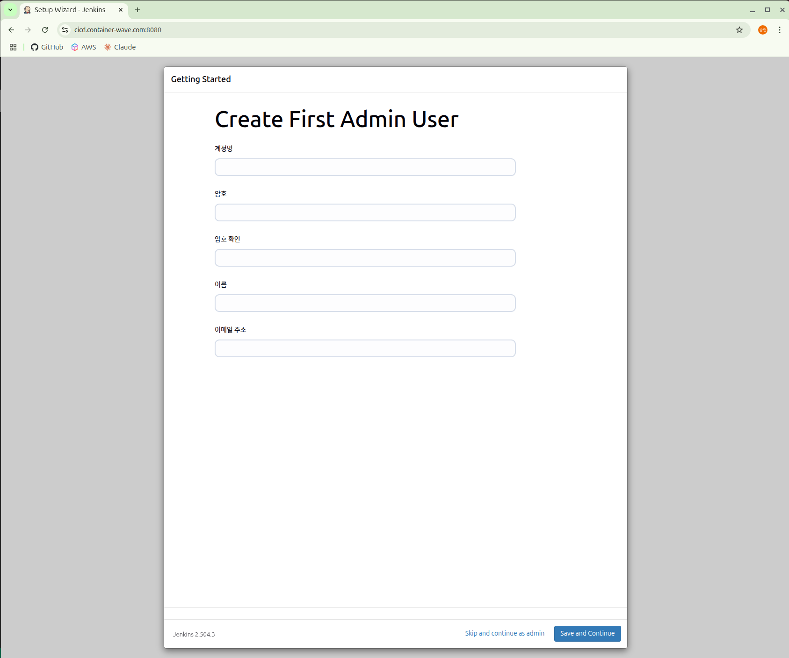

- URL Setting → jenkins setting finish and start

#### 3.6 jenkins plugin 설치

- Jenkins 화면 → Jenkins 관리 → Plugins

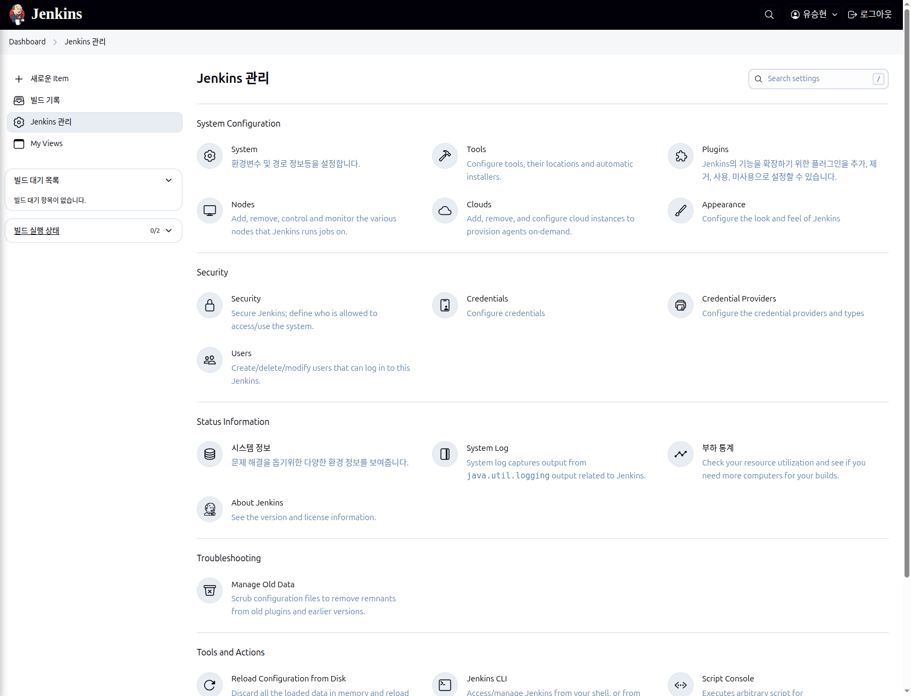

- Available plugins → plugin 검색 및 추가 → install

  - Docker Pipeline

  - Docker Commons

  - Pipeline: Stage View

  - Build Timestamp

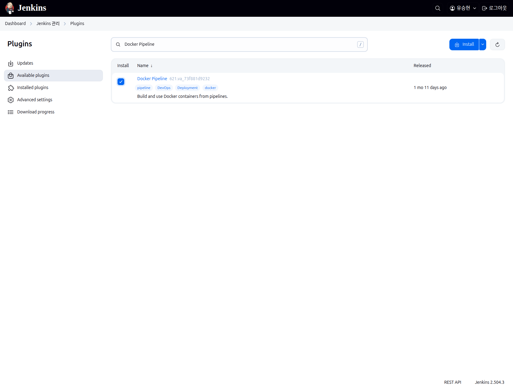

#### 3.7 github webhook 설정

홈 네트워크에서 Jenkins 구성 시 별도 환경에 Reverse Proxy를 구성하지 않았다면 [SCM SSH setting](https://10cheon00.tistory.com/4) 설정을 참고해서 SCM 방식으로 github와 jenkins를 연동해야 한다. Cloud와 같이 홈 네트워크 외부 환경에서 Reverse Proxy를 구성한 경우 Proxy 서버의 IP나 도메인 정보를 기반으로 GitHub WebHook 설정이 가능하다.

- GitHub 저장소 접속 → Settings → Webhooks → Add webhook 클릭

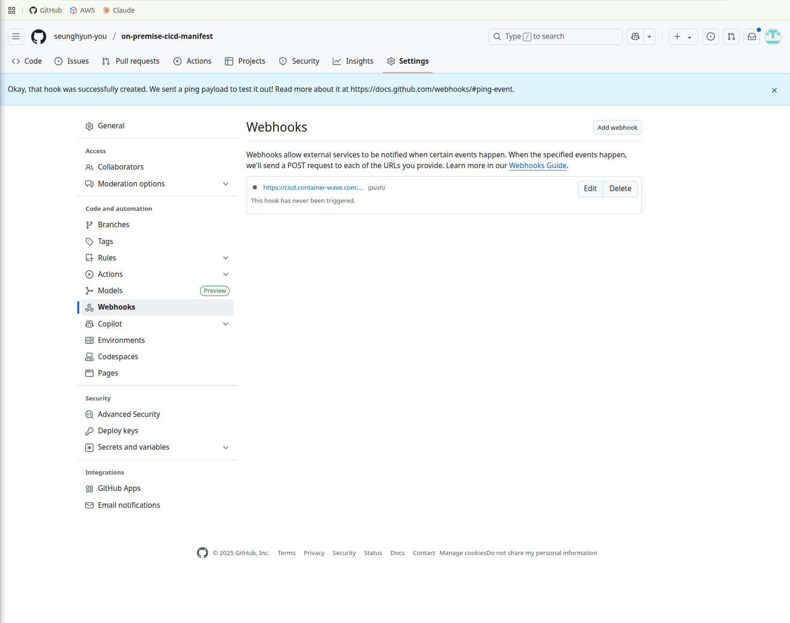

- 설정정보 입력 → Add webhook 클릭

  - Payload URL : http://JENKINS_PUBLIC_IP:8080/github-webhook/

    > [!NOTE] JENKINS_PUBLIC_IP 또는 도메인 정보를 입력 후 `/github-webhook/` 슬래시를 포함해서 입력한다.

  - Content-type : application/json

  - 나머지는 기본 값 설정

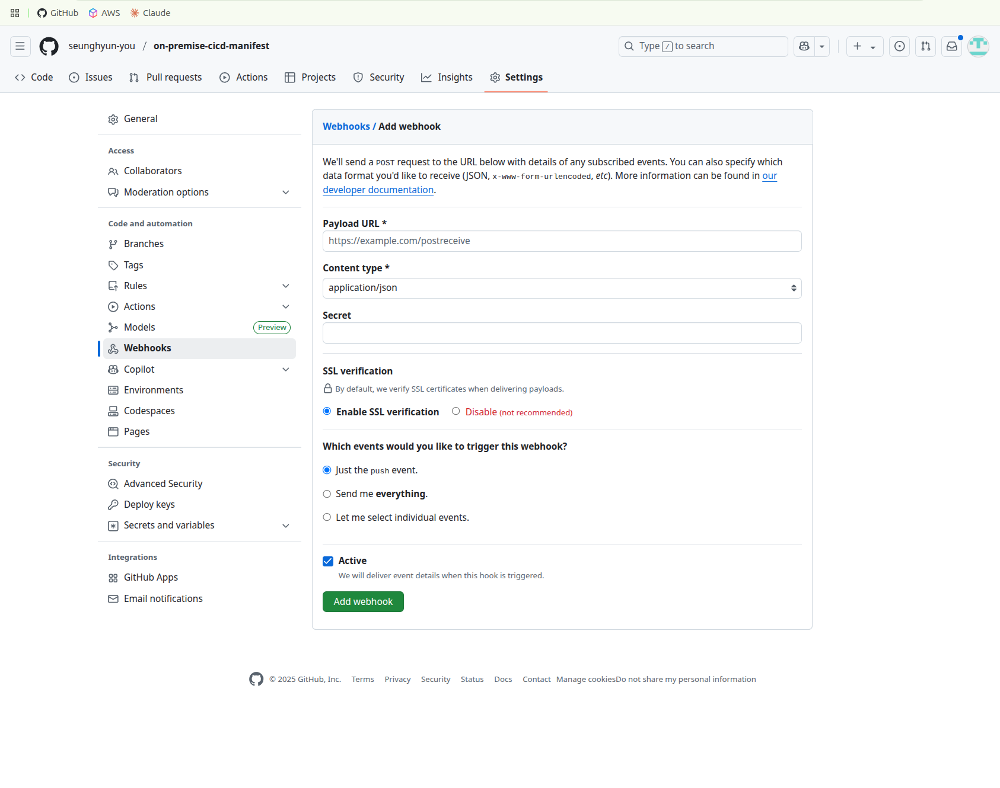

- [GitHub IP 주소 정보](https://api.github.com/meta) 확인 후 방화벽 오픈 설정 필요

#### 3.8 jenkins Credential 설정

- Jenkins 화면 → Jenkins 관리 → Security → Credentials

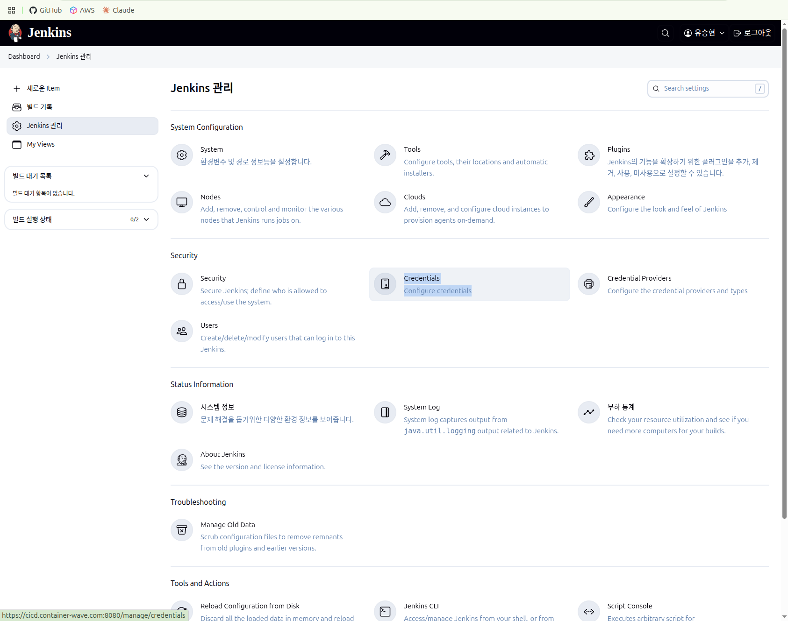

- System → Global credentials (unrestricted) → Add credentials 클릭

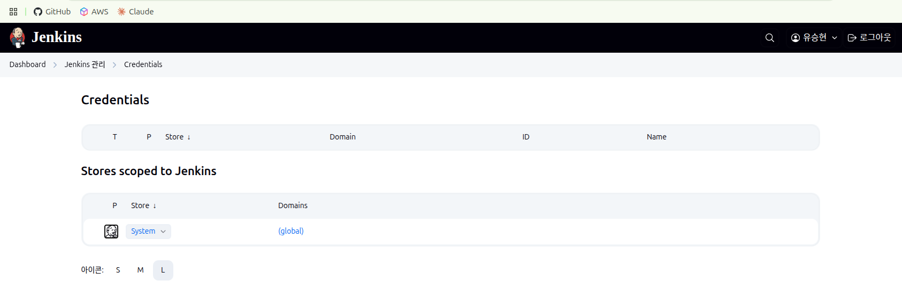

- GitHub Credential 설정

  - Kind : Username with password

  - Username : PERSONAL_ID

  - Password : GITHUB_ACCESS_TOKEN_KEY

  - ID : github-accesskey

  - Description : github 자격증명

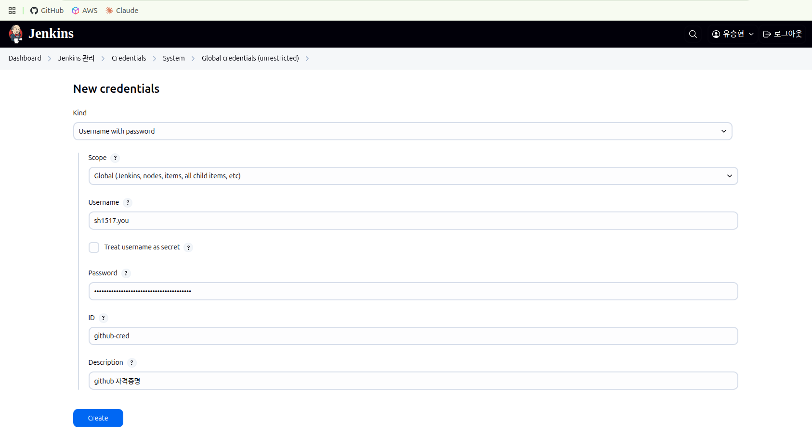

- Nexus Credential 설정

  - Kind : Username with password

  - Username : PERSONAL_ID

  - Password : PERSONAL_PASSWORD

  - ID : nexus-credential

  - Description : nexus 자격증명

#### 3.9 jenkins pipeline 설정

- jenkins 화면 → Item 클릭 → 이름: on-premise-cicd → `pipeline` 선택 → 설정 정보 입력

  - `GitHub project` 클릭 → GtiHub Application 저장소 주소 입력

  - `이 빌드는 매개변수가 있습니다` 클릭 → 정보 입력

    - Name : NEXUS_URL

    - Default Value : NEXUS_IP:8082/REGISTRY_NAME

  - Triggers 섹션에서 'github hook trigger for GITScm Polling' 선택

  - Pipeline 섹션 설정 정보 입력

    - Definition : Pipeline script from SCM

    - SCM : Git

    - Repository URL : GtiHub Application 저장소 주소 입력

    - Credentials : github-accesskey

    - Branch Specifier : `*/main`

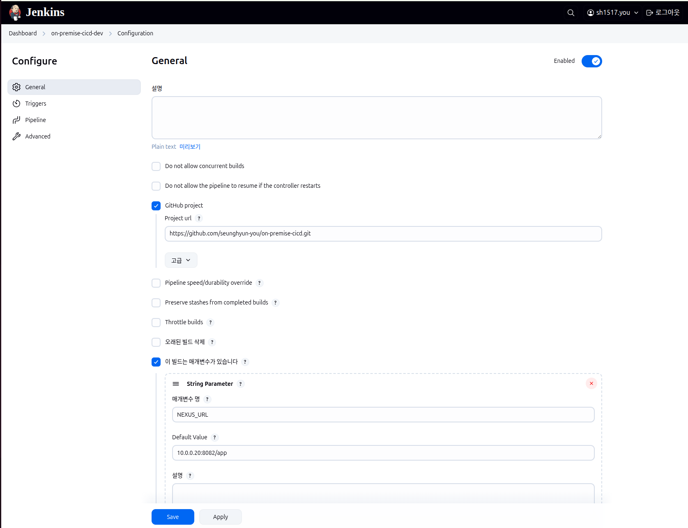

- jenkins pipeline setting
  (file : cicd_sample/node-app/Jenkinsfile)
  (handbook : https://www.jenkins.io/doc/book/getting-started/)

<!-- ### 11. DB Images

- create docker file (postgresql 16.5)

```bash
docker build -t 10.0.0.20:8082/db:v1.0.0
docker push 10.0.0.20:8082/db:v1.0.0
```

- openebs install

```bash
kubectl apply -f https://openebs.github.io/charts/openebs-operator.yaml
kubectl patch sc -n openebs openebs-hostpath -p '{"metadata": {"annotations":{"storageclass.kubernetes.io/is-default-class":"true"}}}'
```

- create manifest

- kubernetes resource test

```bash
ka statefuleset-db.yaml
ka secret-db.yaml
ka service-db.yaml
```

- access test

```bash
k exec -it sts-postgres-db-0 -- su - postgres -c psql
\l
# node table 생성 여부 확인
```

### 12. Argo CD Webhook Setting

- https://dobby-isfree.tistory.com/216 -->
